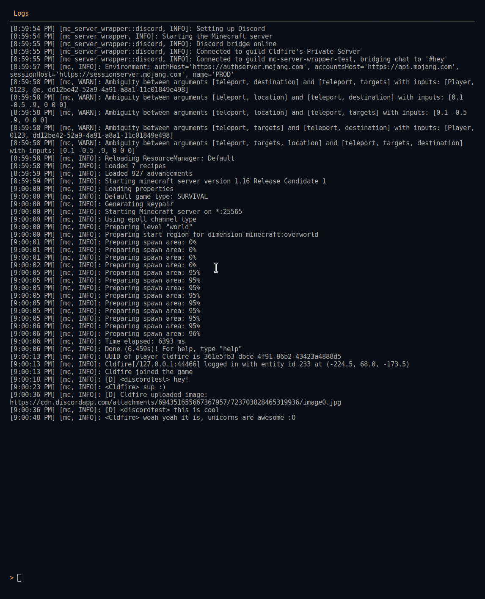

# mc-server-wrapper


[](https://deps.rs/repo/github/cldfire/mc-server-wrapper)

Lightweight Rust program to manage a Java Minecraft server process (vanilla, Spigot, or PaperSpigot), providing niceties such as a Discord chat bridge, server restart-on-crash, and improved console output.

This has been running over top of a small server of mine 24/7 since March 2020 with zero crashes / major issues of any kind. I'd consider it ready for small-scale production usage.

## Features

* Runs on Linux, macOS, and Windows
* Optionally enabled bi-directional Discord chat bridge (see [Discord Bridge Setup](#discord-bridge-setup))
    * Commands (prefixed by `!mc`):
        * `list`: replies with a list of people playing Minecraft
    * Embeds, mentions, and attachments in Discord messages are neatly formatted in Minecraft
    * Bot status message displays server info (such as the names of online players)
* Run server with configurable memory allocation
    * Also allows passing custom JVM flags if desired
* Restart server on crash
* Auto-agree to EULA
* Improved console output formatting

## Installation

### Downloading

You can download prebuilt binaries in the [releases section](https://github.com/Cldfire/mc-server-wrapper/releases).

### Building

You can also build and install from source (requires an up-to-date [Rust](https://www.rust-lang.org) install):

```
cargo install --git https://github.com/Cldfire/mc-server-wrapper.git --locked
```

## Usage

Generate a default config (customize the config path with the `-c` flag if desired):

```
mc-server-wrapper -g
```

Edit the config as required, explanation of options below. You can then start the server with the following (if you used the `-c` flag above use it again here):

```
mc-server-wrapper
```

Run `mc-server-wrapper --help` for some CLI args to quickly override the config with.

### Config

```toml
[minecraft]
# The path to the server jar
server_path = "./server.jar"
# The memory in megabytes to allocate for the server
memory = 1024
# If you would like to pass custom flags to the JVM you can do so here
jvm_flags = "-XX:MaxGCPauseMillis=200"

# The Discord section is optional
[discord]
# Enable or disable the Discord bridge
enable_bridge = true
# The Discord bot token
token = "..."
# The Discord channel ID to bridge to
channel_id = 123
# Enable or disable bot status message updates
update_status = true

# Valid log levels: error, warn, info, debug, trace
#
# Logging levels set here only affect file logging
[logging]
# The log level for general mc-server-wrapper dependencies
all = "Warn"
# The log level for mc-server-wrapper
self = "Debug"
# The log level for Discord-related dependencies
discord = "Info"
```

### Discord bridge setup

* Register an application and a bot with [Discord](https://discordapp.com/developers/applications)
* Enable some things in the `Privileged Gateway Intents` section of the bot's admin portal
    * Toggle `Server Members Intent` on
        * This is used to receive member updates from your guild (such as when someone changes their nickname so we can change the name we display in-game)
    * Toggle `Message Content Intent` on
        * This is used to receive messsage content from the channel for the chat bridge in Discord so we can relay chat there into Minecraft
* Add the bot to the guild you want to bridge to
* Get the ID of the channel you want to bridge to (Google this for instructions)
* Provide the bot token and channel ID in the config file
* Enable the Discord bridge in the config file or with the `-b` flag

## Future plans

* Simple web and CLI interface to administrate server
    * Change most common settings
    * View online players
    * Chat from the web
    * Different levels of accounts (user, admin)
* _further ideas here_

## Library

The binary for this project is built on top of a library; if you want to implement a different feature set than the one I've chosen to, or implement the features in a different way, you can easily do so. See the [`mc-server-wrapper-lib` README](mc-server-wrapper-lib/README.md) and its [basic example](mc-server-wrapper-lib/examples/basic.rs) for more.

```
cargo run --example basic -- path/to/server.jar
```

## Screenshot

Early screenshot, subject to change:



#### License

<sup>
Licensed under either of <a href="LICENSE-APACHE">Apache License, Version
2.0</a> or <a href="LICENSE-MIT">MIT license</a> at your option.
</sup>

<br>

<sub>
Unless you explicitly state otherwise, any contribution intentionally submitted
for inclusion in this crate by you, as defined in the Apache-2.0 license, shall
be dual licensed as above, without any additional terms or conditions.
</sub>
